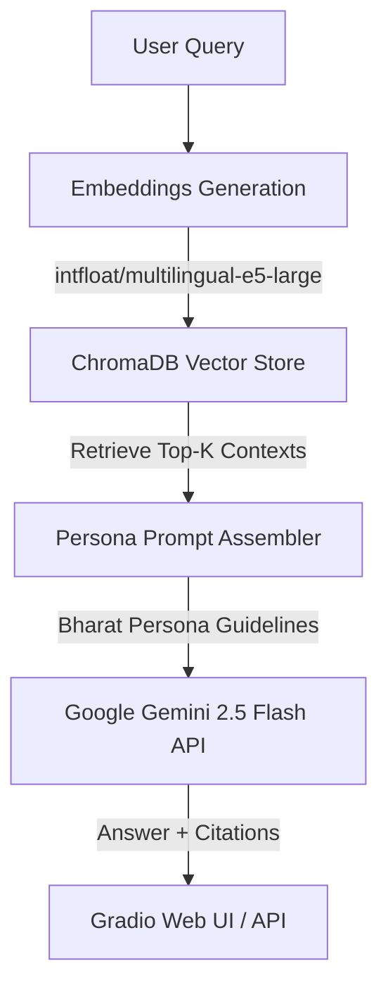

# 🏛️ IKS AI Assistant: "Bharat" — The World's Gateway to Indian Civilization

A specialized, state-of-the-art AI assistant for **Indian Knowledge Systems (IKS)**. It acts as an immersive cultural guide named **Bharat**, explaining India's history, temples, classical music, dance, textiles, mathematics, and philosophy to a global audience.

[](https://www.python.org/downloads/)
[](https://opensource.org/licenses/MIT)
[](https://github.com/astral-sh/ruff)
[](https://huggingface.co/mistralai/Mistral-7B-Instruct-v0.3)
[](https://huggingface.co/spaces/006aman/IKS)

---

## 🔗 Live Demo (Hugging Face Spaces)
Experience the interactive "Bharat" persona live in your browser:
👉 **[Hugging Face Space: IKS AI Assistant](https://huggingface.co/spaces/006aman/IKS)**

---

## 🎯 The Vision: Immersive Storytelling

Most general AI assistants (like GPT-4o, Claude 3.5, or baseline Gemini) treat Indian culture as dry, textbook facts, scoring poorly on niche IKS concepts (around 50-60% accuracy). 

The **IKS AI Assistant** bridges this gap by introducing **Bharat**, a wise, storyteller persona that transforms dry academic concepts into immersive, sensory experiences. Bharat is evaluated on four core dimensions:
*   **Knowledge**: Factually accurate, citing specific names, dates, dynasties, and places.
*   **Transport**: Evokes physical presence (e.g., feeling the stone carvings of a temple under your feet).
*   **Rasa**: Evokes the precise emotional essence of the topic (e.g., *Shanta* for Upanishads, *Vira* for Mauryan battles).
*   **Bharat Voice**: Warm, culturally resonant, and welcoming—never sounding like a dry corporate chatbot.

---

## 🏗️ System Architecture

The project is structured in two parallel architectural layers:

### Phase 1: RAG Retrieval Engine (Live)
Retrieves factually grounded contexts from **286 curated texts** (~4,516 vector chunks) mapped locally via multilingual embeddings.



### Phase 2: Domain-Specific SFT Fine-Tuning (In Progress)
Injects the storyteller persona and deep IKS knowledge directly into **Mistral 7B** using LoRA.

```mermaid
graph TD
    A[Curated IKS Docs] --> B[Data Extraction]
    B -->|Mercury-2 API Generator| C[15,001 pristine ShareGPT pairs]
    C -->|Unsloth LoRA Fine-Tuning| D[Kaggle Dual Tesla T4 / RunPod A100]
    D -->|Export LoRA Adapters| E[Fine-Tuned Mistral 7B "Bharat"]
    E -->|GGUF / Ollama Export| F[Offline Local Inference]
```

---

## 🚀 Quick Start

### ⚙️ Prerequisites & Hardware Recommendations
The local vector store runs embeddings on CPU/CUDA, while inference defaults to Google Gemini API (Free tier). For local LLM deployment, we recommend:

| Setup | Hardware | Recommended Local Model |
| :--- | :--- | :--- |
| **Minimum** | 16GB RAM / Apple Silicon | `mistral:7b` (via Ollama) |
| **Recommended** | 32GB RAM / RTX 3060 (12GB) | `mistral:7b` (via Ollama) |
| **Extreme** | 64GB RAM / RTX 4090 (24GB) | `mistral:7b` (via Ollama) |

### 🔧 Installation

We use the ultra-fast Python package manager **`uv`** to maintain lockfile parity and speed up setups.

```bash
# 1. Clone the repository
git clone https://github.com/Amankumar006/IKS-MODEL.git
cd IKS-MODEL

# 2. Install uv package manager
curl -LsSf https://astral.sh/uv/install.sh | sh

# 3. Synchronize environment and install dependencies
uv sync

# 4. Set up environment variables
cp .env.example .env
# Edit .env and paste your GOOGLE_API_KEY (from Google AI Studio)

# 5. Download base documents
uv run python scripts/data/download_sample_docs.py

# 6. Run the local Gradio application
uv run python src/iks_rag/ui/gradio_app.py
```

Open your browser at **http://localhost:7860** to interact with Bharat.

---

## 📂 Repository Layout

```text
IKS-MODEL/
├── src/
│   ├── iks_common/       # Common shared utilities
│   └── iks_rag/          # Core RAG Retrieval Pipeline
│       ├── ingestion/    # Text & PDF loaders and classification
│       ├── retrieval/    # EmbeddingsManager & ChromaDB vector wrappers
│       ├── generation/   # LLM Wrapper (Gemini, Ollama, OpenAI) & Bharat prompts
│       └── ui/           # Gradio Web Interface
├── scripts/
│   ├── data/             # Scrapers, QA generators, and dataset validators
│   ├── eval/             # 500-question gold-standard benchmark compiler
│   └── train/            # Unsloth Mistral 7B fine-tuning scripts
├── tests/
│   ├── unit/             # Fast, mock-enabled isolated tests
│   └── integration/      # End-to-end components integration checks
├── configs/
│   └── rag/              # YAML configuration files
└── docs/                 # Architecture Decision Records (ADRs) and guides
```

---

## 📊 Project Roadmap

| Phase | Core Features | Status |
| :--- | :--- | :--- |
| **Phase 1: RAG Foundation** | curation of 286 base docs, ChromaDB + Multilingual E5 integration, Gradio UI, HuggingFace Space deploy | ✅ **100% Complete** |
| **Phase 2.1: Data Generation** | 15,001 multi-turn ShareGPT pairs generated and cleaned via Mercury-2 API | ✅ **100% Complete** |
| **Phase 2.4: Evaluation** | 500-question gold-standard benchmark compiled testing held-out texts and adversarial limits | ✅ **100% Complete** |
| **Phase 2.5: SFT Fine-Tuning** | Dual Tesla T4 Kaggle training notebook configured with W&B logging & automatic HF checkpoint backups | 🔄 **In Progress** |
| **Phase 3: Production** | Local GGUF export, hybrid routing, multi-language support (Sanskrit, Tamil, Hindi), cloud deploy | ⏳ **Planned** |

---

## 🧪 Testing and Linting

We maintain a strict quality target of **>80% test coverage**. All checks run locally via:

```bash
# Run the unit test suite
uv run pytest tests/ -v

# Run tests with HTML coverage report
uv run pytest tests/ --cov=src --cov-report=html

# Formatting and linting checks
uv run ruff check src/
uv run ruff format src/
```

---

## 🤝 Contributing

We welcome cultural researchers, AI engineers, and historians to join our gateway initiative! 
For detailed contribution rules, code styles, and Git conventions, check out:
*   **[Code Conventions](docs/ai-context/conventions.md)**
*   **[Contributing Guidelines](docs/project/contributing.md)**

---

## 📄 License
This project is licensed under the MIT License - see the [LICENSE](LICENSE) file for details.

## 📞 Contact & Support
*   **GitHub Issues**: [IKS-MODEL Issues Tracker](https://github.com/Amankumar006/IKS-MODEL/issues)
*   **Email**: 006amanraj@gmail.com
