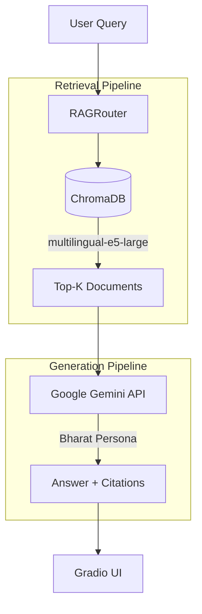

# System Architecture Overview

## Current Phase: Phase 1 (RAG Foundation)

The IKS AI Assistant uses a Retrieval-Augmented Generation (RAG) architecture. This grounds the LLM's responses in curated factual documents regarding Indian Knowledge Systems.

## Core Components

1.  **Ingestion & Indexing** (`src/iks_rag/ingestion/` & `retrieval/`)
    *   Loads PDFs, HTML, TXT, MD
    *   Chunks text via semantic chunker
    *   Embeds chunks using `intfloat/multilingual-e5-large`
    *   Stores vectors in **ChromaDB**

2.  **Generation** (`src/iks_rag/generation/`)
    *   **LLM Provider**: Configured via `configs/rag/default.yaml` (default: Gemini)
    *   **Prompts**: Defined in `prompts.py` using the "Bharat" persona and 9 rasas emotional framework.

3.  **UI & API** (`src/iks_rag/ui/` & `api/`)
    *   **Gradio**: Provides a chat interface with source citations.
    *   **FastAPI**: Headless API for integrations.

*For deeper details on the RAG process, see [`rag-pipeline.md`](rag-pipeline.md).*
