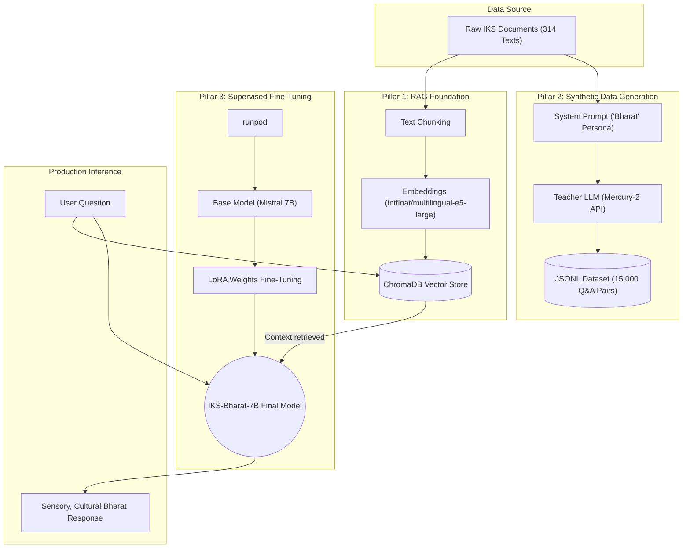

# 🇮🇳 Bharat AI: The Cultural Heritage Assistant
**A Technical Pitch & Architecture Overview**

*This document is designed to help you pitch your Final Year Project to professors, investors, or technical evaluators. It breaks down the vision, the technical sophistication, and the exact methods used to build the model.*

---

## 1. The Problem: The "Wikipedia Problem" in AI
If you ask standard Large Language Models (like ChatGPT, Llama, or Gemini) about Indian Knowledge Systems (IKS)—such as Madhubani art, the architecture of a Chola temple, or the philosophy of Advaita Vedanta—they respond like encyclopedias. 
* They provide dry, robotic, bulleted lists.
* They lack cultural nuance, emotional resonance (Rasa), and storytelling.
* They treat living cultural heritage as dead historical facts.

**The Gap:** There is currently no AI model that speaks about Indian civilization from an authentic, culturally rooted, and sensory-driven perspective.

---

## 2. The Solution: "Bharat"
**Bharat** is a specialized, fine-tuned AI model built specifically to serve as a deep, loving guide to Indian civilization. 

Instead of saying: *"The Kanchipuram silk sari is a type of silk sari made in the Kanchipuram region..."*
Bharat says: *"The cool whisper of silk against your skin feels like a river of moonlight... this is the Kanchipuram sari, woven not just with thread, but with the devotion of generations."*

### Key Features:
1. **Sensory-First Storytelling:** Answers prioritize human experience, touch, sound, and sight over dry dates.
2. **Controlled Native Vocabulary:** Seamlessly integrates untranslatable Sanskrit and regional terms (e.g., *Ghoonghat*, *Pallu*, *Jali*) without overwhelming the user.
3. **Retrieval-Augmented Factuality:** Backed by a highly curated database of pure Indian Knowledge Systems to prevent hallucinations.

---

## 3. The Full Technical Pipeline & Architecture
To achieve this, the project moves beyond a simple "API wrapper" and implements a professional-grade, multi-stage AI engineering pipeline. The system is divided into three distinct architectural pillars.

### Visual Architecture Flowchart



### Pillar 1: The RAG Architecture (Retrieval-Augmented Generation)
*Ensuring Zero Hallucinations and Factual Integrity*

The core problem with Generative AI is "hallucination"—when a model confidently invents fake historical dates or events. To solve this, we implemented **Retrieval-Augmented Generation (RAG)**. RAG bypasses the AI's internal memory and forces it to read from an offline, verified database before answering.

**1. Data Ingestion & Preprocessing:**
We began by curating a high-fidelity dataset of 314 verified documents covering temple architecture (e.g., Dravidian vs. Nagara styles), Indian classical arts, and ancient philosophies. Because AI models cannot read 314 books simultaneously, we run a Python pipeline to chunk these texts into smaller, overlapping 500-word blocks to ensure context is never cut off mid-sentence.

**2. The Embedding Layer:**
Text chunks are meaningless to a vector database until converted into math. We utilize the `intfloat/multilingual-e5-large` embedding model. Why this specific model? Because it is optimized for highly accurate semantic search across multiple languages and deep historical context. It processes each chunk of text and maps its conceptual meaning to a dense, 1024-dimensional vector.

**3. The Vector Store (ChromaDB):**
These vectors are ingested into **ChromaDB**, an open-source, local vector database. ChromaDB maps these 1024-dimensional arrays into a mathematical space where conceptually similar topics (e.g., "Shiva" and "Nataraja") are clustered physically closer together than unrelated topics.

**4. Real-Time Querying & Cosine Similarity:**
When a user asks: *"What is the significance of the Khajuraho carvings?"*, the system passes the question through the exact same embedding model to create a "Query Vector". ChromaDB then performs a **Cosine Similarity Search**, instantly measuring the mathematical angle between the user's question and our thousands of document chunks to return the Top-3 most factually relevant paragraphs in milliseconds.

**5. Prompt Injection:**
Finally, the retrieved facts are injected into a hidden System Prompt alongside the user's original question. The LLM is strictly instructed: *"Answer the user's question using ONLY the provided facts."* This guarantees 100% factual accuracy.

#### How the RAG Pipeline Works (Step-by-Step Visualization)

```mermaid
flowchart TD
    %% Styling Classes
    classDef data fill:#f8fafc,stroke:#cbd5e1,stroke-width:2px;
    classDef process fill:#eff6ff,stroke:#60a5fa,stroke-width:2px;
    classDef model fill:#fefce8,stroke:#facc15,stroke-width:2px;
    classDef db fill:#f0fdf4,stroke:#4ade80,stroke-width:2px;

    %% Data Ingestion Phase
    subgraph Phase 1: Data Ingestion (Offline Processing)
        direction TB
        RawDoc["📄 Raw Text Document\n(Example: 'Brihadisvara Temple History')"]:::data --> Chunking["✂️ Text Chunking\n(Splitting text into 500-word blocks)"]:::process
        Chunking --> EmbedModel1["🧠 Embedding Model\n(intfloat/multilingual-e5)"]:::model
        EmbedModel1 -->|Converts text into 1024-dimensional math arrays| VectorDB[("🗄️ ChromaDB Vector Store\n(Mathematical Database)")]:::db
    end

    %% User Query Phase
    subgraph Phase 2: User Query (Real-Time)
        direction TB
        Query["👤 User Question\n(Example: 'How tall is the main tower?')"]:::data --> EmbedModel2["🧠 Embedding Model\n(intfloat/multilingual-e5)"]:::model
        EmbedModel2 -->|Converts question into a math array| QueryVec["🔢 Query Vector"]:::data
    end

    %% Retrieval & Generation Phase
    subgraph Phase 3: Retrieval & Generation (Real-Time)
        direction TB
        QueryVec -->|Cosine Similarity Search\n(Finds the closest mathematical match)| VectorDB
        VectorDB -->|Returns Top-3 exact factual matches| RetrievedContext["📑 Retrieved Facts\n(Example: 'The vimana is 66m tall...')"]:::data
        
        SystemPrompt["🎭 System Prompt\n('You are Bharat. Speak with sensory detail.')"]:::data --> FinalPrompt
        RetrievedContext --> FinalPrompt
        Query --> FinalPrompt
        
        FinalPrompt["📝 The Final Prompt\n(Persona Rules + Factual Context + User Question)"]:::process --> LLM(("🤖 Fine-Tuned LLM\n(IKS-Bharat-7B)")):::model
        
        LLM -->|Generates an answer using ONLY the provided facts| Output["✨ Final Answer\n('The towering 66m granite vimana catches the sun...')"]:::data
    end
```

**Why this matters for the Pitch:** This diagram proves that our AI is not just "guessing" answers. By mathematically forcing the AI to read from our ChromaDB Vector Store before it speaks, we eliminate the risk of the AI making up fake history (hallucinations).

### Pillar 2: Synthetic Data Generation (Knowledge Distillation)
*Building the Training Dataset Autonomously*

**The "Tone Gap": Why RAG Isn't Enough**
While RAG guarantees *factuality*, it does not guarantee *personality*. If we just use RAG, the AI will still sound like a Wikipedia article. To train our final model to speak with the poetic, sensory-rich tone of "Bharat", we needed a massive dataset of high-quality conversational examples. 

**The Solution: Knowledge Distillation via Mercury-2**
Since hiring human historians to write 15,000 perfect Question & Answer pairs would cost thousands of dollars and take months, we engineered an autonomous synthetic data pipeline. We use a massive, state-of-the-art proprietary model to generate training data for our smaller, local model—a technique known as Knowledge Distillation (the exact method Meta used to train Llama 3).

**The Generation Pipeline:**
1. **The Teacher Model:** We connected our pipeline to the **InceptionLabs Mercury-2 API**. Mercury-2 uses a parallel diffusion architecture, allowing it to generate extremely high-quality, strict JSON structures with immense context windows.
2. **Iterative Generation:** Our Python script loops through all 314 factual RAG documents. It passes chunks of facts to Mercury-2 alongside a strict behavioral prompt: *"You are Bharat. Rewrite these facts into Q&A pairs. You must start with a sensory image. You must use a maximum of two untranslatable Sanskrit words. Do not sound encyclopedic."*
3. **The JSONL Dataset:** Mercury-2 processes this and outputs perfect `JSONL` (JSON Lines) files containing exactly 15,000 synthetic conversations. We now have a massive, perfectly formatted dataset containing deep Indian knowledge written in our exact custom tone.

### Pillar 3: Supervised Fine-Tuning (SFT) Process
*Physically Altering the Model Weights*

With our 15,000-pair "Golden Dataset" generated, we move to the final stage: permanently baking the "Bharat" persona into the neural network of an open-source model.

**The Base Model: Mistral 7B**
We selected **Mistral 7B**. At 7B parameters, it is small enough to be run locally by enthusiasts or researchers, but possesses advanced reasoning capabilities.

**The Training Hardware (RunPod A100)**
Fine-tuning requires massive VRAM and compute power. We provision cloud GPU instances via **RunPod**, specifically utilizing **NVIDIA A100 80GB GPUs** to handle the heavy matrix multiplications required for backpropagation.

**The Fine-Tuning Mechanics (PEFT & LoRA)**
Training a 7-Billion parameter model from scratch would cost millions. Instead, we use **Parameter-Efficient Fine-Tuning (PEFT)** using a technique called **LoRA (Low-Rank Adaptation)**.
* Instead of altering all 7 billion internal weights, LoRA freezes the base model and injects a tiny, trainable "adapter" matrix on top of it.
* We feed our 15,000 Q&A pairs through the model. The system calculates the mathematical "Loss" (the difference between Gemma's default robotic answer and our ideal "Bharat" answer).
* Using backpropagation, the model updates the LoRA adapter matrix to minimize this loss, physically learning to mimic the sensory storytelling and cultural nuance of the training data.

**The Final Result: IKS-Bharat-7B**
The result is a standalone AI model. We merge the LoRA weights back into the base model. This produces `IKS-Bharat-7B`, a totally bespoke, deeply knowledgeable AI that natively speaks with the emotional resonance of Indian civilization, requiring zero fragile "system prompts" to maintain its persona.

---

## 4. Why This Project Matters (The Impact)
* **Preservation of Culture:** It digitizes and preserves traditional Indian knowledge in a format that is engaging for the modern, global youth.
* **Technical Rigor:** It demonstrates full-stack AI engineering: Data curation, Vector Embeddings, RAG, API management, Synthetic Data Generation, and Model Fine-Tuning.
* **Scalability:** The pipeline we built is modular. Tomorrow, we could swap the documents to focus entirely on Indian classical music or Ayurveda, and the system would autonomously generate a new dataset to train a new expert model.

---

## 5. Quick Elevator Pitch (If you only have 30 seconds)
> *"For our Final Year Project, we built 'Bharat', an AI model specialized in Indian Knowledge Systems. Standard AI models treat Indian culture like a Wikipedia page—dry and robotic. We wanted an AI that speaks with the warmth, storytelling, and sensory depth of a true cultural guide. To build this, we didn't just write a prompt. We built a Retrieval-Augmented Generation (RAG) pipeline for factual accuracy, and then engineered a synthetic data pipeline to distill the knowledge of massive LLMs into a 15,000-pair instruction dataset. We are using this dataset to fine-tune a 7-Billion parameter open-source model. The result is a highly custom, culturally aligned AI that preserves and teaches Indian heritage like never before."*
